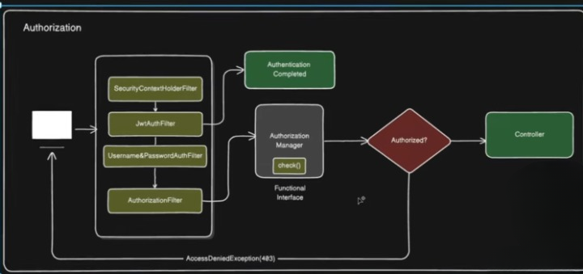
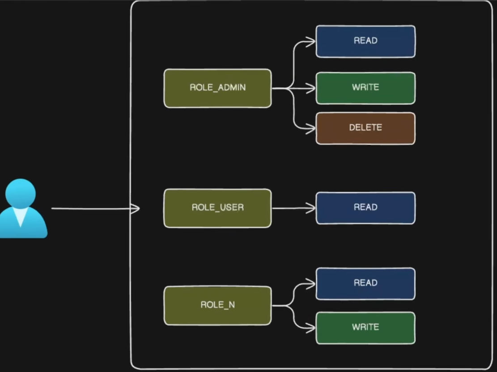

# 🔐 Authorization

**Authorization** is the process of deciding **what actions an authenticated user is allowed to perform** on application resources.

In simple terms:
- **Authentication** → Who are you?
- **Authorization** → What are you allowed to do?

---

## 👤 Roles and Permissions

### 🔹 Roles
Roles represent a **high-level authority** assigned to a user.

Examples:
```
ROLE_ADMIN
ROLE_USER
```

- `ROLE_` is the **default prefix** used by Spring Security
- If you want to change this prefix, you must define a **custom `GrantedAuthorityDefaults` bean**

---

### 🔹 Permissions
Permissions are **fine-grained actions** defined under a role.

Examples:
```
READ
WRITE
DELETE
UPDATE
```

Usually:
- **Roles** → Collection of permissions
- **Permissions** → Actual operations allowed on resources


---

## 🔁 Authorization in Spring Security Filter Chain

- Authorization happens **after authentication**
- Once authentication is successful, the **AuthorizationFilter** is triggered
- By default, `AuthorizationFilter` comes **after authentication filters** in the Spring Security filter chain

---

## 🧠 AuthorizationManager

After authentication:

1. `AuthorizationFilter` intercepts the request
2. It delegates the authorization decision to **AuthorizationManager**
3. This is similar to how `AuthenticationFilter` delegates to `AuthenticationManager`

### 🔹 AuthorizationManager
- It is a **functional interface**
- Main method:
```java
check(Authentication authentication, Object object);
```

- It checks whether the request is **authorized or not** based on roles/authorities

---

## 🧩 AuthorizationManager Implementations

Spring Security provides multiple implementations, such as:

- `RequestMatcherDelegatingAuthorizationManager`
- `AuthorityAuthorizationManager`
- `PreAuthorizeAuthorizationManager`
- `PostAuthorizeAuthorizationManager`

---

### 🔹 RequestMatcherDelegatingAuthorizationManager

- Uses **RequestMatcher** to match incoming requests
- Matches based on URL, HTTP method, etc.
- Decides whether a request is authorized according to configured rules

Example:
- `/admin/**` → ROLE_ADMIN
- `/user/**` → ROLE_USER

---

## ✅ Authorization Decision Flow

- If the request is **authorized** → it proceeds to the controller
- If the request is **not authorized** → Spring Security throws an `AccessDeniedException`

---

## 📊 Complete Authorization Flow Diagram



---

## below role-permission flow diagram


## ✅ Summary

- Authorization decides **what a user can access**
- It runs **after authentication**
- `AuthorizationFilter` delegates decisions to `AuthorizationManager`
- Decisions are based on **roles and permissions**
- Authorized → request reaches controller
- Not authorized → access denied error
