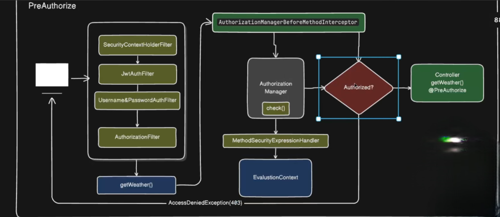

## 🔐 Method-Level Security (In Simple Words)

Method-level security means protecting **individual methods** in your controller or service layer.
Instead of securing only URLs, we can decide **who can execute which method**.

Spring Security provides annotations like:
- `@PreAuthorize`
- `@PostAuthorize`
- `@Secured`
- `@RolesAllowed`

Among these, **`@PreAuthorize` is used the most** because it supports expressions and gives fine-grained control.

---

## ⚙️ How `@PreAuthorize` Works Internally

Let’s understand this in **simple, human language**, step by step.

---

### 1️⃣ Request Comes In

1. A client sends a request (example: `/getWeather`).
2. The request enters the **Spring Security filter chain**.
3. Authentication happens (JWT / Basic Auth / Form Login).
4. If authentication is successful, the request moves towards the controller method.

```http
GET /getWeather
```

At this point, the user is **authenticated**.

---

### 2️⃣ Method Has `@PreAuthorize`

Suppose your method looks like this:

```java
@PreAuthorize("hasAuthority('WEATHER_READ')")
public Weather getWeather() {
    return weatherService.getWeather();
}
```

Because this method has `@PreAuthorize`, Spring **will not call the method directly**.

---

### 3️⃣ Spring AOP Intercepts the Method

Before the method executes:
- Spring AOP intercepts the method call
- A security interceptor is triggered

The interceptor used is:

```text
AuthorizationManagerBeforeMethodInterceptor
```

Its job is to **check authorization before the method runs**.

---

### 4️⃣ AuthorizationManager Is Used

The interceptor delegates the decision to an `AuthorizationManager`.

For `@PreAuthorize`, Spring uses:

```text
PreAuthorizeAuthorizationManager
```

This manager decides whether the user is allowed to execute the method or not.

---

### 5️⃣ Reading the `@PreAuthorize` Expression

The `PreAuthorizeAuthorizationManager` reads the expression written inside `@PreAuthorize`, such as:

```java
hasRole('ADMIN')
hasAuthority('WEATHER_READ')
```

To evaluate this expression, Spring uses:

```text
MethodSecurityExpressionHandler
```

---

### 6️⃣ EvaluationContext Is Created

Spring creates an `EvaluationContext` which contains:
- Logged-in user details
- Authentication object
- Roles and permissions (authorities)
- Method parameters (if used in expression)

Using this context, Spring evaluates the expression.

---

### 7️⃣ Final Decision

- ✅ If the expression evaluates to **true**:
  - Method execution is allowed
  - The actual method is called

- ❌ If the expression evaluates to **false**:
  - Spring throws `AccessDeniedException`
  - Client receives:
    ```http
    403 Forbidden
    ```

---

## 🔄 Overall Flow (Simple View)

```text
Request
  ↓
Security Filter Chain (Authentication)
  ↓
Controller / Service Method
  ↓
AuthorizationManagerBeforeMethodInterceptor
  ↓
PreAuthorizeAuthorizationManager
  ↓
Expression Evaluation
  ↓
✔ Allowed → Method Executes
❌ Denied  → 403 Forbidden
```

---

## ✅ Key Points to Remember

- `@PreAuthorize` works using **Spring AOP**, not filters
- Authorization happens **before** method execution
- It checks roles and permissions using expressions
- Same authorization concept is used at both request and method level
- If authorization fails, Spring returns **403 Forbidden**

---

## 📌 Best Practice

- Use `hasRole()` for role-based checks
- Use `hasAuthority()` for permission-based checks
- Prefer method-level security for **business logic protection**

## Complete flow diagram below



## @PostAuthorize 
`@PostAuthorize` annotation in Spring Boot is used for method-level access control that runs after a method 
executes, primarily to check if the returned object should be accessible to the user based on specific 
criteria. 

--> It will have same internal working like @PreAuthorize ,only difference is replace `pre` with `post` and 
`before` with `after`

## 🧠 Key Difference from `@PreAuthorize`

| Annotation | When it runs | What it checks |
|---------|-------------|----------------|
| `@PreAuthorize` | Before method execution | User roles / permissions |
| `@PostAuthorize` | After method execution | Returned object (`returnObject`) |

The annotation is placed on a service or repository method that returns an object, using Spring Expression
Language (SpEL) to evaluate the condition. The built-in SpEL variable returnObject is used to access the
returned value of the method. 

```java
  import org.springframework.security.access.prepost.PostAuthorize;
import org.springframework.stereotype.Service;

@Service
public class BankService {

    // ... other service methods

    /**
     * Retrieves an Account object, but only returns it if the authenticated 
     * user is the owner.
     */
    @PostAuthorize("returnObject.owner == authentication.name")
    public Account getAccountDetails(Long accountId) {
        // Method logic runs first to fetch the account from the database
        Account account = findAccountById(accountId);
        // The security expression is evaluated AFTER this point
        return account;
    }

    private Account findAccountById(Long accountId) {
        // Actual database call to find the account
        // Example placeholder:
        // if (accountId.equals(1L)) return new Account(1L, "john_doe");
        // else return null;
        return new Account(accountId, "some_owner");
    }
}

```

In this example, if the owner property of the returned Account object does not match the name of the 
currently authenticated user (authentication.name), Spring Security will throw an AccessDeniedException. 

**Use Case:** Ideal for scenarios where the authorization decision depends on the properties of the data 
being returned, such as ensuring a user can only view their own records (preventing Insecure Direct
Object References - IDOR).

## @PostFilter
`@PostFilter` is used for method-level security when a method returns a collection (like `List`, `Set`, etc.).

`@PostAuthorize` → works on a single returned object

`@PostFilter` → works on each element inside a returned collection

When the return type is a list of objects, @PostFilter is the correct choice.

## Difference Between `@PostAuthorize` and `@PostFilter`

- `@PostAuthorize` → works on **single object return types**
- `@PostFilter` → works on **collection return types**

## ⚙️ How @PostFilter Works

1. The method executes first
2. The full collection is returned from the method
3. Spring Security evaluates the security expression
4. Each element in the collection is checked
5. Only the allowed elements are kept in the response

The remaining elements are **filtered out**.

## 🧠 Special SpEL Variable

`@PostFilter` provides a built-in SpEL variable:

```text
filterObject

filterObject represents each element inside the returned collection

The expression is evaluated for every item

```

## Example 

```java
   import org.springframework.security.access.prepost.PostFilter;
import org.springframework.stereotype.Service;

@Service
public class OrderService {

    @PostFilter("filterObject.owner == authentication.name")
    public List<Order> getOrders() {
        // Fetches all orders from database
        return orderRepository.findAll();
    }
}

```

### What happens here?

All orders are fetched from the database

Only orders owned by the logged-in user are returned

Orders belonging to other users are removed from the response

### What If No Items Match?

The method still executes

No exception is thrown

An empty list is returned

(This is different from `@PostAuthorize`, which throws `AccessDeniedException`.)
