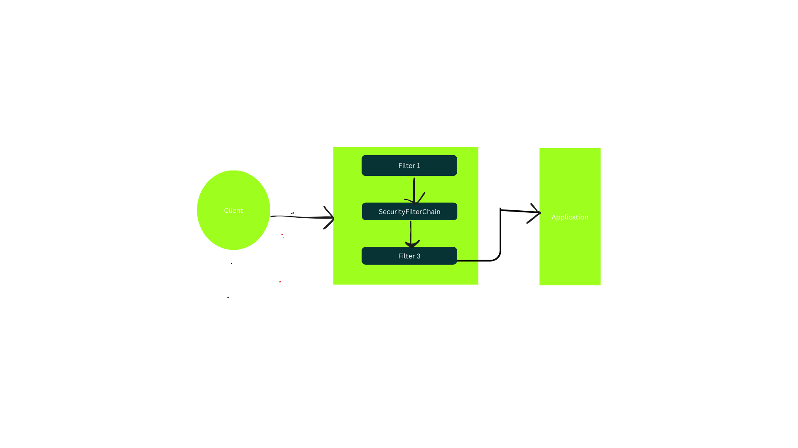
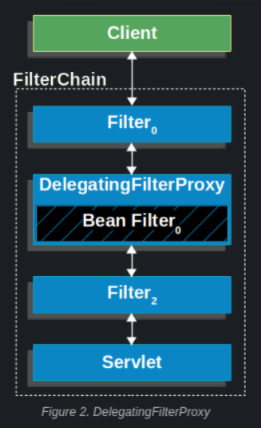
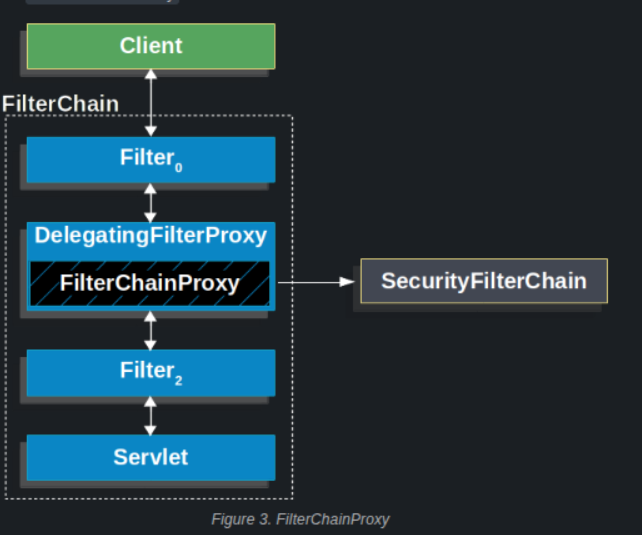
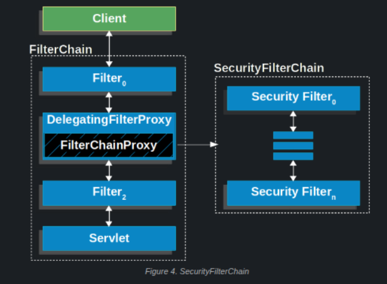
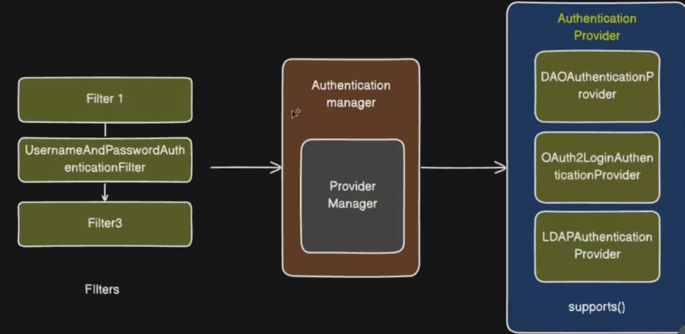
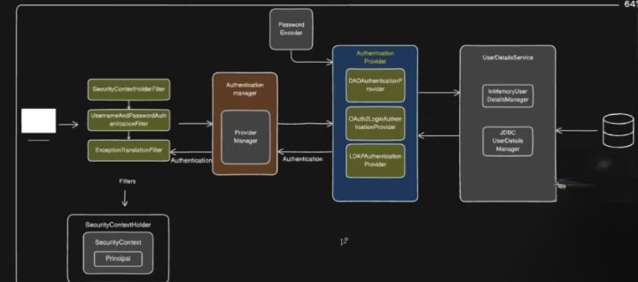

### Spring security architecture

When you add the `spring-boot-starter-security` dependency, Spring Boot auto-configures Spring Security
for your application then SecurityFilterChain is added into the filter chain 

SecurityFilterChain can have multiple Filter instances.



## DelegatingFilterProxy

The Servlet API and the Spring `ApplicationContext` have their own lifecycles, and we need a way to 
integrate them.

The Servlet container can register `Filter` instances using its own mechanism, but it is not aware of 
Spring-managed beans.A filter registered directly with the Servlet container cannot use Spring dependency
injection.

Spring provides a `Filter` implementation named `DelegatingFilterProxy` that acts as a bridge between the
Servlet container’s lifecycle and the Spring `ApplicationContext`.

You register `DelegatingFilterProxy` with the Servlet container (e.g., under the name 
`springSecurityFilterChain`), and it delegates all the work to a Spring bean (also named
`springSecurityFilterChain`) that itself implements `Filter`.

Here is a picture of how `DelegatingFilterProxy` fits into the filter chain:



## FilterChainProxy

`FilterChainProxy` is a special `Filter` provided by Spring Security. It delegates the request to one of 
the internal security filter chains (`SecurityFilterChain` instances), and each `SecurityFilterChain` is 
made up of multiple security filters.

Since `FilterChainProxy` is a Spring bean, it is typically the target of `DelegatingFilterProxy`.

In practice, the structure looks like this:

- The Servlet container calls **`DelegatingFilterProxy`**
- `DelegatingFilterProxy` delegates to the Spring bean **`FilterChainProxy`** 
 (usually named `springSecurityFilterChain`)
- `FilterChainProxy` selects the appropriate **`SecurityFilterChain`**
- The chosen `SecurityFilterChain` runs its list of security **`Filter`** instances





## SecurityFilterChain
SecurityFilterChain is used by FilterChainProxy to determine which Spring Security Filter instances 
should be invoked for the current request.

The following image shows the role of SecurityFilterChain.



It contains the list of actual security filters like:

1. UsernamePasswordAuthenticationFilter

2. JwtAuthenticationFilter

3. ExceptionTranslationFilter

4. AuthorizationFilter
etc.

A SecurityFilterChain contains the list of actual security filters, for example:

Security Filter	Responsibility
UsernamePasswordAuthenticationFilter--> Handles form-based username/password login
JwtAuthenticationFilter	--> Validates request using JWT token
ExceptionTranslationFilter-->	Handles security exceptions and redirects / responses
AuthorizationFilter-->	Checks whether the authenticated user has required roles/permissions


## How authentication technologies fit here (DB, OAuth2, LDAP, JWT etc.)

Spring Security supports different ways of authentication -
for example, username/password from database, OAuth2 login, LDAP login, JWT login, and so on.

Spring cannot hard-code all these authentication mechanisms inside each filter; that would be extremely complicated.
To solve this, each authentication method has its own AuthenticationProvider:

Authentication Type	       AuthenticationProvider
Username / Password	-->    DaoAuthenticationProvider
OAuth2 Login-->         	OAuth2LoginAuthenticationProvider
LDAP Login	-->            LdapAuthenticationProvider
JWT Authentication-->   	Custom JwtAuthenticationProvider

So the filter does not perform authentication directly - it delegates authentication to an AuthenticationProvider.

Example:
If you are using username/password login, UsernamePasswordAuthenticationFilter does not authenticate directly.
It delegates to DaoAuthenticationProvider, which performs authentication using UserDetailsService and PasswordEncoder.

# Problem: Many filters + many providers → who calls whom?

There can be multiple AuthenticationFilters and multiple AuthenticationProviders.
So Spring needs a way to decide which provider should handle the request coming from a particular filter.

# Solution: AuthenticationManager

Spring Security solves this problem using the AuthenticationManager.

The filter calls AuthenticationManager

AuthenticationManager finds the correct AuthenticationProvider

That AuthenticationProvider performs the authentication

AuthenticationManager itself is just an abstraction.
The most common implementation is `ProviderManager`, which:

Loops through all available AuthenticationProviders

Calls the one whose supports() method returns true for the incoming request

AuthenticationProvider has the supports() method which returns true if it can handle the authentication request.


```css

Client Request
     ↓
UsernamePasswordAuthenticationFilter / JwtAuthenticationFilter / OAuth2AuthenticationFilter
     ↓ delegates to
AuthenticationManager (ProviderManager)
     ↓ selects correct
AuthenticationProvider
     ↓
Authentication succeeds OR fails

```

AuthenticationManager has authenticate() method.

The filter (e.g., username/password or JWT) calls AuthenticationManager.authenticate()

AuthenticationManager (most commonly implemented as ProviderManager) iterates over the configured AuthenticationProviders

For each provider, it calls supports() to check if the provider can handle the request

When a provider returns supports() = true, its authenticate() method is executed

# Important distinction
Component	            Method	         Purpose
AuthenticationManager->	authenticate()-> Delegates authentication to a provider
AuthenticationProvider->supports()->     Decides whether this provider can handle the request
AuthenticationProvider->authenticate()-> Performs the actual authentication

# AuthenticationManager has only one important method:
```java
   Authentication authenticate(Authentication authentication) throws AuthenticationException;
```

# AuthenticationProvider has two methods:

```java
   Authentication authenticate(Authentication authentication) throws AuthenticationException;
   boolean supports(Class<?> authentication);

```

authenticate() → performs the actual authentication
supports() → tells whether this provider supports the given authentication type

Diagram below for complete flow




# How AuthenticationProvider checks username/password inside the database

Now the question is - how does the `AuthenticationProvider` actually evaluate the username and password 
that it receives?
We definitely have a database to store user details, but how will the `AuthenticationProvider` retrieve 
that user information from the database? To solve this problem, Spring provides the `UserDetailsService` 
interface. It has implementations like `InMemoryUserDetailsManager`, `JdbcUserDetailsManager`, etc.,
which actually connect to your database and fetch the user information. Once the user details are fetched,
the `UserDetailsService` returns that information back to the `AuthenticationProvider`.

But we never store plain passwords in the database. So how is the password verified?
To handle this, `AuthenticationProvider` uses `PasswordEncoder` which encodes the password before saving it 
to the database. And during authentication time, the password sent by the user is again encoded and then 
compared with the encoded password stored in the database (password is never decoded).

Once the `AuthenticationProvider` successfully authenticates the request, it returns an `Authentication`
object to the `AuthenticationManager`, and from the `AuthenticationManager` it goes back to the filter.
Now this `Authentication` object needs to be stored somewhere so other parts of the application can reuse 
it. Spring already has a solution for this - called `SecurityContext`.

`SecurityContext` stores the authentication (principal) object, and Spring provides an abstraction called 
`SecurityContextHolder` to access it. `SecurityContextHolder.getContext()` gives you the authenticated 
principal anytime in your application.

Filter sets the SecurityContextHolder with the Authentication object.

Once you are logged in, you don’t need to log in again and again because `SecurityContextHolderFilter` 
remembers that your request is already authenticated. The next time you call the application, it checks
the context and says “you’re already authenticated, no need to do it again.”

And if anything goes wrong during authentication or authorization, we have `ExceptionTranslationFilter` 
that will handle the exception and redirect to the error page / send the proper response.

Diagram below for complete flow:

